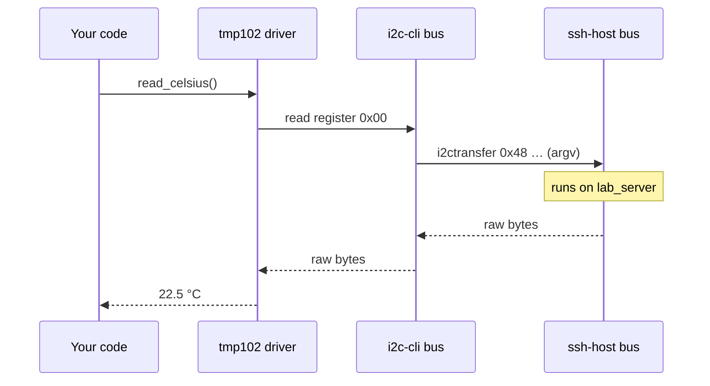

<div align="center">

# SHAL

### A test sequencer an agent can drive — safely.

**One file describes everything your test touches** — the board on the bench, the
database behind it, the service it calls — with the risk of each operation written
down. Run it from Python or pytest at the bench. Hand it to an AI agent as typed,
gated tools: reads run free; **anything that moves or reconfigures stops for a person.**

> Behind the door: SHAL is the capability layer for AI agents operating engineering
> and production systems — hardware and software through one governed interface.
> Testing is the first use. The moat is one word: *physical*.

> In a blind test, an agent wrote working, safety-checked drivers for **4 of 4**
> devices from documentation alone — then drove a **real robot, gated**.
> *Founder-run, not yet independently replicated.*

<!-- BADGES -->
[](https://github.com/determlab/shal)
[](https://pypi.org/project/pyshal/)
[](#install)
[](https://github.com/determlab/shal/blob/main/LICENSE)
[](#roadmap)

<picture>
  <source srcset="docs/assets/SHAL_banner.webp" type="image/webp">
  
</picture>


### [→ Try it in 60 seconds — no hardware required](#quick-start)

</div>

**Built for:**

✓ Validation & test engineers who already write Python &nbsp;·&nbsp; ✓ Production test stations &nbsp;·&nbsp;
✓ Labs with mixed hardware + software &nbsp;·&nbsp; ✓ AI agent builders who need a gate before the wire

---

## From glue scripts to agent tools — in three steps

**Step 1 · Today, without SHAL** — a separate library, address, and retry per device:

```python
sensor  = TMP102(i2c_bus, 0x48)
supply  = SCPIPowerSupply("10.0.0.50:5025")
results = RESTClient("https://mes.lab.internal")
# ...and you wire each one's retries, logging, and tool-wrapper by hand
```

**Step 2 · With SHAL** — describe the rack once, then call devices by name:

```python
hal = shal.load("lab.yaml")

hal.get_device("ambient_temp").read_celsius()       # I²C sensor
hal.get_device("dut_power").set_voltage(3.3)        # SCPI supply
hal.get_device("results_db").record(status="pass")  # HTTP service
```

> **Validation & test engineers can stop here.** One model for the whole rack —
> no agent needed, no transport code, no glue.

**Step 3 · Hand the same rack to an agent** — the tool catalog is generated for you:

```python
tools = hal.tool_schemas()                           # one typed tool per device op
hal.call_tool("dut_power__set_voltage", {"volts": 3.3})
```

> Writes are gated, reads aren't. The agent never sees SCPI, I²C, or an address.

---

## Why existing agent frameworks fall short

Most agent tooling assumes **software-only** tools: APIs, databases, functions.
The moment a tool is a *physical* device — a sensor on I²C, an instrument over a
raw socket, a robot behind a network hop — you're on your own.

SHAL exposes physical devices, remote labs, instruments, **and** software
services as the *same* kind of tool — with the safety rails physical actions
need: gated writes, honest failure, a full audit trail.

---

## One model for hardware *and* software

The core idea is small:

> **A bus is just a node that provides a transport to its children.**

A sensor on I²C and an HTTP service are the same kind of node. Your code — and
your agent — calls **capabilities** (`read_celsius()`, `set_voltage()`), never
transports. `[core]` ships with SHAL; `[pkg]` is a driver you install or write.

```yaml
# lab.yaml — hardware and software in ONE graph
shal_version: 1
root:
  bench:                         # one SSH hop to the bench controller       [core]
    driver: shal,ssh-host
    address: ${BENCH_SSH}        # secrets resolve from the environment, never logged
    children:
      i2c0:                      # I²C rendered as argv over the SSH hop      [core]
        driver: shal,i2c-cli
        address: /dev/i2c-1
        children:
          ambient: { id: ambient_temp, driver: ti,tmp102, address: 0x48 }   # [core]

  instruments:                   # raw-socket SCPI bus                        [pkg]
    driver: acme,scpi
    address: 10.0.0.50:5025
    children:
      supply: { id: dut_power, driver: keysight,e36312, address: ch1 }       # [pkg]

  services:                      # HTTPS to internal services                [core]
    driver: shal,http
    address: https://mes.lab.internal
    children:
      results: { id: results_db, driver: acme,mes-results, address: api/v2 } # [pkg]
```

Every node is reached the same way — `hal.get_device("dut_power").set_voltage(3.3)`
— sensor or database, local or across the network. Same retries, same logs. Swap
any node for its sim and **nothing in your code changes**.

---

## Features

- **Agent-native** — every device op becomes a gated LLM tool.
- **Asks before it moves** — actuator & destructive/config ops stop for a
  host-supplied approver (CLI prompt, an agent, or auto in sim/CI); the gate is
  pre-I/O and unbypassable.
- **Hardware + software, one graph** — a sensor and an HTTP service are the same node.
- **Capabilities, not wires** — call `read_celsius()`, never I²C.
- **Retry you can trust** — reads auto-retry; risky writes never silently repeat.
- **Sim-first** — test the whole rack with zero hardware.
- **Recursive** — muxes, jumpboxes, nested buses: one primitive, no special cases.
- **Drivers as plugins** — add a device in one small class.
- **Secure by default** — no shell strings, TLS on, secrets via `${ENV}`.
- **Observable** — structured logs, one `txn` id per call.

---

## Install

> SHAL is in **alpha** (Phase 1).

```bash
pip install pyshal      # package is `pyshal`; you import it as `shal`
```

```python
import shal
```

For development:

```bash
git clone https://github.com/determlab/shal && cd shal
pip install -e ".[dev]"   # pytest, ruff
```

Requires **Python ≥ 3.10** for SHAL core. A device's own library may need newer — the
featured Deebot path (`deebot-client`) needs **3.11+** (`asyncio.TaskGroup`); build that
venv on 3.11+. Dependencies: `pyyaml`, `jsonschema`.

---

## Quick Start

Runs with **zero hardware** — the simulated bus ships with SHAL. New to hardware?
This is the whole setup, and it's just Python and a YAML file.

```yaml
# sim.yaml
shal_version: 1
root:
  bus:
    driver: shal,sim-i2c
    address: sim0
    children:
      temp0:
        id: ambient_temp
        driver: ti,tmp102
        address: 0x48
```

```python
import shal

with shal.load("sim.yaml") as hal:
    print(hal.get_device("ambient_temp").read_celsius())   # 25.0
```

```bash
$ python quickstart.py
25.0
```

When the real board arrives, change `shal,sim-i2c` → `shal,i2c-cli`. **Your
Python doesn't change.**

---

## Reuse a board — `use:` and `with:`

A bench description isn't text you paste into the next project. It's a file the
next project points at.

Describe the board once, with `${param}` placeholders for whatever differs:

```yaml
# board.yaml
shal_version: 1
template:                       # a `use:` target must define `template:`
  driver: shal,sim-i2c
  address: sim0
  children:
    temp:
      id: ${prefix}_temp
      driver: ti,tmp102
      address: 0x48
```

Then reference it as many times as you need:

```yaml
# rig.yaml
shal_version: 1
root:
  bench_a: { use: board.yaml, with: { prefix: a } }
  bench_b: { use: board.yaml, with: { prefix: b } }
```

```python
import shal

with shal.load("rig.yaml") as hal:
    print(hal.get_device("a_temp").read_celsius())   # 25.0
    print(hal.get_device("b_temp").read_celsius())   # 25.0
```

Both benches come up as separate devices, and each op becomes its own agent tool
(`a_temp__read_celsius`, `b_temp__read_celsius`).

**The second bench is a reference, not a copy** — fix `board.yaml` and every rig
that uses it is fixed.

Details worth knowing:

- **`${param}` substitutes into every string in the template, including `id`.**
  That is how you avoid the global duplicate-id error when the same board appears
  twice: give each instance its own prefix.
- **The using node's own keys override the template's**, so a rig can change one
  address without editing the board file.
- **Includes chain** — a template may itself be a `use:` node. Cycles are
  detected and refused.
- **Paths are confined to the topology root.** A `use:` that escapes it via `../`
  is an error, not a warning.
- Values not supplied by `with:` fall back to `${ENV_VAR}` resolution.

---

## Drive it from an agent (MCP)

Expose a whole topology to an MCP host (Claude Code/Desktop, …) as gated tools —
no glue:

```bash
pip install "pyshal[mcp]"
shal mcp lab.yaml            # reads run free; writes ask a human first
```

Register it with your host (example `mcpServers` block):

```json
{"mcpServers": {"shal": {"command": "shal", "args": ["mcp", "lab.yaml"]}}}
```

Now tell the agent *"read the DUT temperature"* (runs immediately) or *"set
3.3 V"* — a write **pauses**: the agent gets an `approval_required` ticket and a
human approves the `shal_approve` tool before anything reaches hardware. Opt into
free writes with `--approve auto` (the choice is recorded in the audit log).

**Already own a device with a Python library?** Wrapping it as a SHAL driver is a
few lines — see the ready-to-edit examples in [examples/demos/](https://github.com/determlab/shal/tree/main/examples/demos/)
(a Sonos speaker, a Deebot vacuum), then point SHAL at your topology:

```bash
shal probe my-setup.yaml   # one-shot: print your devices' state, then exit
shal mcp   my-setup.yaml   # or serve it to an AI host (writes gated)
```

---

## Write a driver in 30 seconds

Need a device SHAL doesn't have yet? A driver is one small class. This is the
*entire* bundled temperature-sensor driver:

```python
from shal import Driver, TemperatureSensor, registry, idempotent, op, ByteTransport, Read, Write

@registry.register
class Tmp102(Driver, TemperatureSensor):
    compatible = "ti,tmp102"          # matched against the YAML `driver:` field
    kind = ByteTransport
    llm_ready = True

    @idempotent                        # a read: safe to auto-retry across drops
    @op("Read the ambient temperature now.", unit="celsius", side_effect="none")
    def read_celsius(self) -> float:
        raw = self.bus.txn(self.addr, [Write(b"\x00"), Read(2)])
        return ((raw[0] << 4) | (raw[1] >> 4)) * 0.0625
```

That's it — register the `compatible`, implement the capability. The `@op`
metadata is what makes it show up as a gated agent tool. SHAL discovers your
driver via the `shal.drivers` entry point.

---

## How It Works

A topology is a tree, and **every edge is a bus** — itself a node that carries
traffic to its children. You call a capability; SHAL translates it down the stack
to the wire and hands the result back up. No layer leaks into the one above.



Because every hop is the same primitive, an SSH jumpbox, an I²C mux, and an
in-process sim all compose — no special cases.

---

## Core Concepts

| Concept | What it means |
|---|---|
| **Node** | Anything in the tree: a device, a bus, a board. |
| **Bus** | A node that provides a transport to its children (I²C, SSH, HTTP…). |
| **Driver** | Bound to a node by its `compatible` string. Implements a capability. |
| **Capability** | The typed API your code calls (`read_celsius()`), independent of transport. |
| **id vs path** | `id` is a stable name for lookup; `path` is where it sits. Move a device, keep its `id`. |

```python
hal.get_device("ambient_temp").read_celsius()   # by semantic id — no wires leak in
```

---

## Real-World Use Cases

- **AI agents with real-world access** — expose a lab or robot to an LLM as
  gated tools; every actuator call stops for a human (or policy) to approve
  before it fires, and a delivery-unknown write is never silently retried.
- **Validation & test racks** — one model for eval boards, instruments, and the
  results database; test against sims in CI before hardware.
- **Manufacturing lines** — same capability calls across stations; one audit
  trail (`shal.audit`) for every actuator command.
- **Remote & distributed setups** — drive hardware behind an SSH jumpbox with
  nothing on the far side but standard CLI tools.
- **Robotics bringup** — start against a sim, swap in transports as boards land,
  without rewriting control code.

---

## FAQ

**Why not just wrap Python libraries as agent tools myself?**
You can — until there are ten devices on four transports, some behind an SSH hop,
some not. Then you're hand-maintaining a tool wrapper, address, retry policy, and
audit log *per device*. SHAL generates all of it from one topology.

**Is it production-ready?**
It's **alpha** (Phase 1). The synchronous core — topology, drivers, buses, retry
policy, and the agent tool surface — is real and tested. Async/streaming, the
actuator watchdog, and route failover are Phase 2 ([roadmap](#roadmap)).

**Do I need real hardware to try it?**
No. The bundled simulated bus runs the [Quick Start](#quick-start) with zero
hardware — swap in a real transport later, and your code doesn't change.

---

## Roadmap

**Shipped — Phase 1 (synchronous core, v0.1.0):**

- ✅ Declarative YAML topology: JSON-Schema validation, `id`/`path`/`$ref`,
  `${ENV}` secrets, reusable `template:` includes
- ✅ Bundled buses: `sim-i2c`, `local`, `ssh-host`, `i2c-cli`, `spi-cli`,
  `tcp` (TLS), `http`, `nxp,pca9548` mux
- ✅ Capability model, driver plugin registry, trustworthy retry policy
- ✅ Agent tool surface: `tool_schemas()` / `tool_catalog()` / `call_tool()`
- ✅ Human-in-the-loop actuation gate: actuator ops stop for an injectable
  `Approver` (pre-I/O, unbypassable, every decision audited)
- ✅ Structured observability + `capture()` flight recorder

**Designed, in progress — Phase 2:**

- 🚧 Async / streaming (`subscribe`, held channels) — [spec](https://github.com/determlab/shal/blob/main/docs/design/DESIGN%20-%20PHASE%202%20ASYNC.md)
- 🚧 Actuator watchdog & safe-state (timeouts, auto safe-state on disconnect)
- 🚧 Route failover for multi-path devices

---

## Documentation

- [**Driver SDK** — the complete authoring contract](https://github.com/determlab/shal/blob/main/src/shal/SDK.md) (write a driver from docs alone)
- [Driver / bus catalog](https://github.com/determlab/shal/blob/main/docs/CATALOG.md)
- [Architecture & locked decisions](https://github.com/determlab/shal/blob/main/docs/design/DESIGN%20V2.md)
- [Phase 1 implementation decisions](https://github.com/determlab/shal/blob/main/docs/design/archive/DECISIONS%20-%20V2.1.md)
- [Phase 2 async + watchdog spec](https://github.com/determlab/shal/blob/main/docs/design/DESIGN%20-%20PHASE%202%20ASYNC.md)
- Build guides: write a [driver](https://github.com/determlab/shal/blob/main/integrations/claude-code/skills/shal-build-driver/SKILL.md),
  a [bus](https://github.com/determlab/shal/blob/main/integrations/claude-code/skills/shal-build-bus/SKILL.md), or a
  [topology](https://github.com/determlab/shal/blob/main/integrations/claude-code/skills/shal-build-yaml/SKILL.md)

---

## Contributing

Contributions welcome — **new drivers and buses especially**. A driver is one
small class (see [above](#write-a-driver-in-30-seconds)); SHAL discovers it via
the `shal.drivers` entry point.

```bash
pip install -e ".[dev]"
python -m pytest          # test suite
ruff check src tests      # lint
```

See [CONTRIBUTING.md](https://github.com/determlab/shal/blob/main/CONTRIBUTING.md) for the full guide.

---

## License

[MIT](https://github.com/determlab/shal/blob/main/LICENSE).
